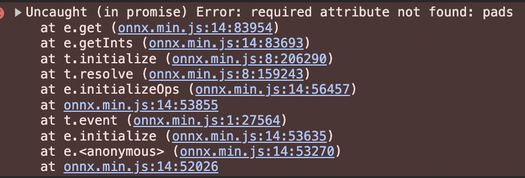
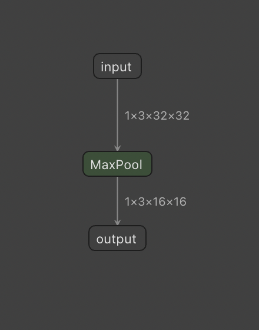
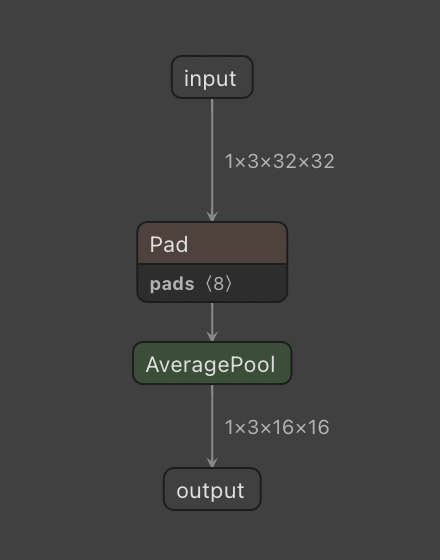

# README


The goal of this repo is to export the [OpenAI CLIP RN50](https://github.com/openai/CLIP) model from  pytorch to onnx-js compatible one.
Exporting to onnx is not complicated, but since onnx-js has a lot of missing features, we need to rewrite some part of the model from scratch (ex. flatten, averagepooling).


## How to launch (and quick sanity check)

```bash
# 1) launch the clip exporting script:
$ python export_clip_rn50_to_onnx.py

# 2) launch the webserver
$ python -m http.server 

# 3) go at http://localhost:8000/ load the model and compute the embedding
# this should export and download the computed embedding if a file named
# `ebds.json` (check your downloads files)… move this file into this dir
$ # manual step…

# 4) compute the cosine similarity between the python and the js 
# embeddings version of the exact same image
$ python compare_onnx_python_ebds_with_onnx_js.py 
```

After following all these steps, you should have somthing like that printed on your terminal:
> `cos sim: 0.9890805389150994`


## Disscussing the issues encoutred in the conversion

### Issue with the AvgPool2d layer

When you try to load a the onnx exported version of the CLIP RN50 in onnx.js you will face to this issue: 



However if you export the default pytorch ResNet50 you don't face it. 
It's due to the fact that CLIP use average pooling while the traditionnal resnet is using max pooling.

Let's export first these two layers alone:

```python
In [1]: import torch.nn as nn

In [2]:     torch.onnx.export(
   ...:         nn.AvgPool2d(2),
   ...:         torch.zeros(1, 3, 32, 32),
   ...:         "avg_pool_layer.onnx",
   ...:         export_params=True,
   ...:         opset_version=17,
   ...:         do_constant_folding=True,
   ...:         input_names=["input"],
   ...:         output_names=["output"],
   ...:     )

   In [3]:     torch.onnx.export(
   ...:         nn.MaxPool2d(2),
   ...:         torch.zeros(1, 3, 32, 32),
   ...:         "max_pool_layer.onnx",
   ...:         export_params=True,
   ...:         opset_version=17,
   ...:         do_constant_folding=True,
   ...:         input_names=["input"],
   ...:         output_names=["output"],
   ...:     )
```

By taking a deeper look to the onnx model structure with [Netron](https://netron.app/) of those two layer we can see where onnx.js struggle.


| MaxPool2d | AvgPool2d |
|---|---|
|  |  |


To solve this issue quickly (not the best way), my idea is to consider that the average pooling layer can be written with convolution with weights being only 0 and 1 with a pre-defined structure. 
Thus I can change all the AvgPool2d layers by these "special" conv layers.

There is how I propose to re-implement the avg pooling from convolutions:

```python
def make_avgpool2d_from_conv(n_channels, kernel_size):
    avgpool2d = nn.Conv2d(
        n_channels, n_channels, kernel_size, stride=kernel_size, bias=False
    )

    avgpool2d.weight.data = torch.zeros_like(avgpool2d.weight.data)
    for i in range(avgpool2d.weight.shape[0]):
        avgpool2d.weight.data[i, i] = (
            torch.ones_like(avgpool2d.weight.data[i, i]) / kernel_size ** 2
        )

    avgpool2d.weight.data = avgpool2d.weight.data.detach()
    return avgpool2d
```

### Issue with .flatten()

This one is simpler, since flatten is not implemented in onnx.js, you just need to re-write your own flatten operation with a `.view`.


Kiss Kiss Bang Bang
💋💋🔫🔫

